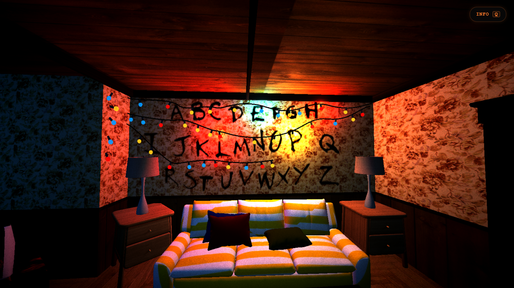

# Montauk Project

A Stranger Things interactive 3D web experience built with Three.js and Cannon-es. Explore four interconnected scenes — from Joyce Byers' living room to the Upside Down — with physics-based movement, dynamic lighting, spatial audio, and post-processing VFX.



## Abstract

Montauk Project is a first-person virtual tour through the universe of Stranger Things, implemented entirely in WebGL. The player navigates four scripted scenes using keyboard/mouse or mobile touch controls, experiencing environmental storytelling, physics colliders, procedural audio, and real-time post-processing effects. The project demonstrates advanced Three.js techniques: modular scene management, GLTF asset instancing, UV-scrolling tunnel illusion, particle systems, and shader-based post-processing.

## Keywords

`three.js` `cannon-es` `webgl` `stranger-things` `interactive-3d` `first-person` `vite` `web-audio-api` `post-processing`

## Introduction

This project was developed as a final assignment for a Computer Graphics course. It combines multiple 3D graphics techniques into a single cohesive experience: 3D model loading (GLTF/GLB), physically-based rendering (PBR) materials, real-time lighting, rigid-body physics, procedural and spatial audio, custom shaders, and post-processing effects (film grain, vignette). The narrative arc takes the player through four distinct environments inspired by the Netflix series Stranger Things, with each scene introducing a new technical challenge.

## How to Navigate / Instructions

- **Desktop**: Click the "Enter Facility" button to start. Use WASD to move, mouse to look around. Press `F` to toggle the flashlight. Press `L` in Scene 2 to toggle the Demogorgon chase sequence.
- **Mobile**: Use the virtual joystick (bottom-left) to move and drag anywhere on the screen to look around. Tap the flashlight button (bottom-right) to toggle light. Rotate to landscape for the best experience.
- **Scene 1 (Joyce's Living Room)**: Type "HELP" on the interactive alphabet wall (or tap the bulbs on mobile) to open the portal.
- **Scene 2 (Hawkins Lab Hallway)**: Walk toward the red organic rift at the end of the corridor to trigger the transition.
- **Scene 3 (Organic Tunnel)**: Sit back — the UV-scrolling tunnel creates a free-fall illusion. The scene auto-transitions after 5 seconds.
- **Scene 4 (Rainbow Room)**: Explore the destroyed sensory deprivation tank room. Approach the central tank to reach the ending.
- **Debug**: Type `help` anywhere (except Scene 1) to teleport to the next scene.

## Running Locally

```bash
# Clone the repository
git clone https://github.com/charly05tr/proyecto-montauk.git
cd proyecto-montauk

# Install dependencies
npm install

# Start the development server
npm run dev

# Build for production
npm run build

# Preview production build
npm run preview
```

Requires Node.js 18+ and a modern browser with WebGL support.

## Authors

- **Carlos Torres** — [github.com/charly05tr](https://github.com/charly05tr)
- **Yasser Rugama** — [github.com/yasserugama](https://github.com/yasserugama)
- **Karla López** — [github.com/karla-jss](https://github.com/karla-jss)
- **Félix Sequeira** — [github.com/Feloxsj50](https://github.com/Feloxsj50)

## License

This project is open source under the MIT License. See the [LICENSE](LICENSE) file for details.

## Conclusion

Montauk Project integrates real-time 3D graphics, physics simulation, procedural audio, and interactive storytelling into a single browser-based experience. Each scene showcases a different aspect of WebGL development: asset pipelining and lighting in Scene 1, modular geometry instancing and stochastic effects in Scene 2, UV animation in Scene 3, and particle systems with post-processing in Scene 4. The result is a technically diverse demo that runs across desktop and mobile platforms using only open-web standards.
